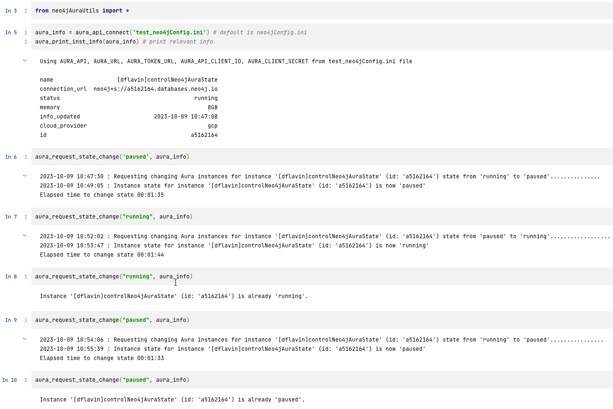

# aura-API-start-pause
Python file and example notebook using the Neo4j Aura API start and pause Neo4j Aura instances.
See the [Aura API docs](https://neo4j.com/docs/aura/platform/api/overview/) for more information.
- Aura API keys are to be included in the neo4jConfig.ini file locally, which is accessed using the ```configparser``` package.

